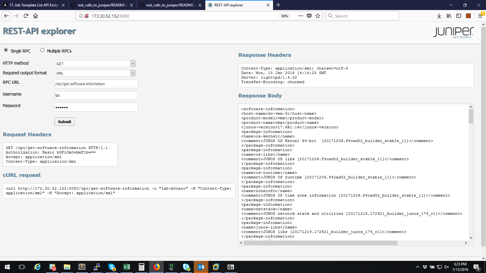
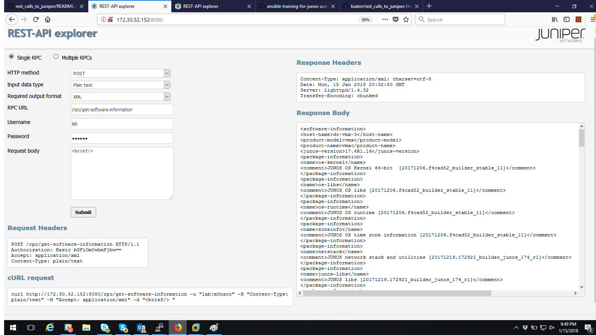
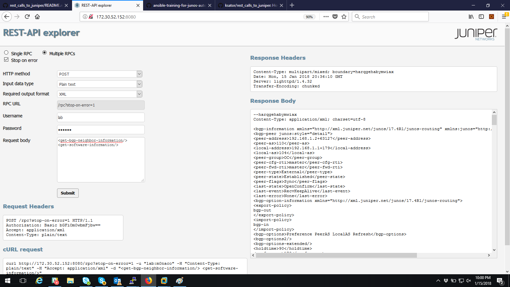
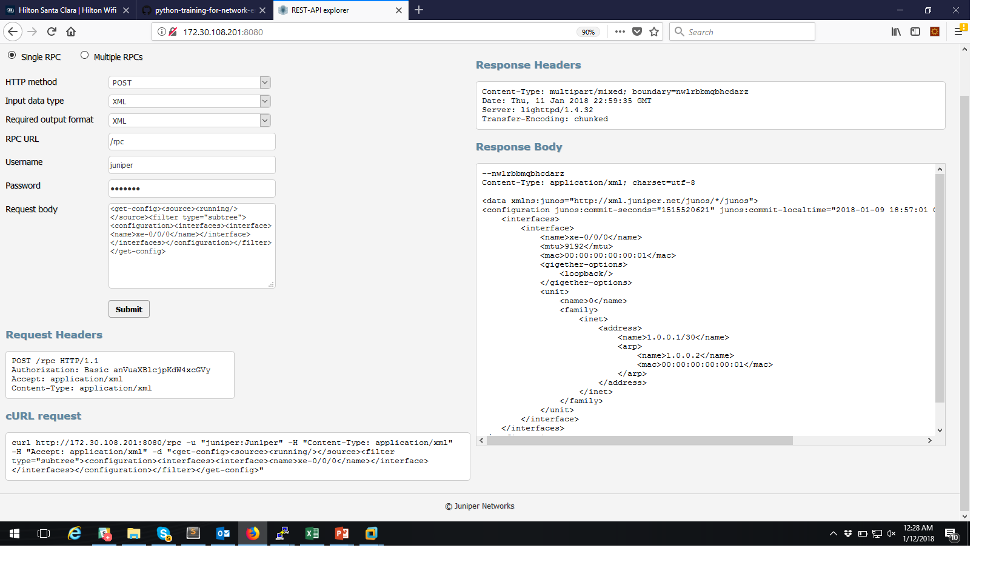

# Repository documentation structure

- [**What to find in this repository**](README.md#what-to-find-in-this-repository)
- [**How to get locally the content of the remote repository**](README.md#what-to-find-in-this-repository)
- [**About REST API**](README.md#about-rest-api)
- [**REST calls with Python**](README.md#rest-calls-with-python)
- [**JUNOS REST API**](README.md#junos-rest-api)
    - [**junos REST API guide**](README.md#junos-rest-api-guide)
    - [**how to get the equivalent RPC of a junos show command**](README.md#how-to-get-the-equivalent-rpc-of-a-junos-show-command)
    - [**how to enable REST API on Junos**](README.md#how-to-enable-rest-api-on-junos)
    - [**how to use Junos REST API explorer**](README.md#how-to-use-the-junos-rest-api-explorer)
    - [**how to make REST calls with curl**](README.md#how-to-make-rest-calls-with-curl)
    - [**how to make REST calls with python**](README.md#how-to-make-rest-calls-with-python)
- [**JUNOS SPACE REST API**](README.md#junos-space-rest-api)
- [**Looking for more Junos automation solutions**](README.md#looking-for-more-junos-automation-solutions)

# What to find in this repository

This repository has basic REST calls examples for Juniper solutions.

# How to get locally the content of the remote repository

```
sudo -s
git clone https://github.com/ksator/rest_calls_to_juniper.git
cd rest_calls_to_juniper/
```
You can now use the local copy of this remote repository.  

# About REST API

Junos, Junos space, Contrail, Northstar, ... have REST API.  
You first need to get the REST API documentation for your system.   
Then you can use a graphical REST Client (REST Easy, RESTClient, Postman, ...) to start playing with REST APIs and learn more about REST APIs.  
Graphical REST clients are for humans, so if you need automation and programmatic access, you have to use other REST clients. You can then use Python as a REST Client to handle REST Calls.  

# REST calls with Python

We can use Python librairies to make REST calls. I am using the library requests.  

Example: google map has a public API (read only). The python script [**google_map_api.py**](google_map/google_map_api.py) prompts you for an address, and then uses the google map API to get data for that address, and print its latitude and longitude. Run this command to use it:  
```
python google_map_api.py
```

# JUNOS REST API

You can use HTTP get and post methods to submit RPCs to the REST Server.  
You can retrieve data in XML or JSON.  
REST configuration is under “system services” (default port is 3000)  
REST Explorer is an optional tool (GUI) for testing  

### Junos REST API guide
it is located [**here**](https://www.juniper.net/documentation/en_US/junos/information-products/pathway-pages/rest-api/rest-api.pdf) 

### How to get the equivalent RPC of a Junos show command?

Each junos show command has an equivalent rpc.   
To get the equivalent rpc of a Junos show command, add ```| display xml rpc``` at the end of the show command.  
Run this command to get the equivalent rpc of ```show version``` (which is ```get-software-information```):
```
lab@spine-03> show version | display xml rpc
<rpc-reply xmlns:junos="http://xml.juniper.net/junos/17.3R1/junos">
    <rpc>
        <get-software-information>
        </get-software-information>
    </rpc>
    <cli>
        <banner></banner>
    </cli>
</rpc-reply>
```

Some show commands use arguments, so the equivalents rpc require arguments:  
Run this command to get the equivalent rpc of ```show chassis hardware clei-models | display xml```. There is one argument in the rpc.
```
pytraining@mx80-17> show chassis hardware clei-models | display xml rpc 
<rpc-reply xmlns:junos="http://xml.juniper.net/junos/17.2R1/junos">
    <rpc>
        <get-chassis-inventory>
                <clei-models/>
        </get-chassis-inventory>
    </rpc>
    <cli>
        <banner></banner>
    </cli>
</rpc-reply>
```

Run this command to get the equivalent rpc for ```show route receive-protocol bgp 192.168.10.4 active-path hidden | display xml```. There are several arguments in the rpc.
```
pytraining@newhostname> show route receive-protocol bgp 192.168.10.4 active-path hidden | display xml rpc    
<rpc-reply xmlns:junos="http://xml.juniper.net/junos/12.3R11/junos">
    <rpc>
        <get-route-information>
                <active-path/>
                <bgp/>
                <peer>192.168.10.4</peer>
                <hidden/>
        </get-route-information>
         </rpc>
        <cli>
            <banner>{master:0}</banner>
        </cli>
    </rpc-reply>
```

### How to enable REST API on Junos

Run these commands to enable REST API on Junos. The default port is 3000.  
The below commands enable also a graphical REST API Explorer that allow to conveniently experiment with REST APIs.  
```
lab@dc-vmx-3> show configuration system services rest | display set
set system services rest http
set system services rest enable-explorer
```

### How to use the Junos REST API explorer

Here's how to use the Junos REST API explorer to make a REST call to get Junos data in XML. This example uses an HTTP GET. The RPC is ```get-software-information```. There is no argument in the RPC. This is the equivalent of ```show version | display xml```. The default port is 3000, but I am using 8080 in this example.     
  

Here's how to use the Junos REST API explorer to make a REST call when there are arguments in the RPC. This is the equivalent of ```show version brief | display xml```. The RPC is ```get-software-information``` and the RPC argument is <brief/>.
```
lab@jedi-vmx-2-vcp> show version brief | display xml rpc
<rpc-reply xmlns:junos="http://xml.juniper.net/junos/17.2R1/junos">
    <rpc>
        <get-software-information>
                <brief/>
        </get-software-information>
    </rpc>
    <cli>
        <banner></banner>
    </cli>
</rpc-reply>
```
In that case, we use an HTTP POST, despite it is only to read data. The default port is 3000, but I am using 8080 in this example.     


Here's how to use the Junos REST API explorer to make a REST call with several RPC. In that case, we use an HTTP POST, despite it is only to read data. The default port is 3000, but I am using 8080 in this example.       
  

Here's how to use the Junos REST API explorer to make a REST call with filters to get Junos data. This example uses an HTTP POST. This is the equivalent of ``` show configuration interfaces ge-0/0/0 | display xml```. The default port is 3000, but I am using 8080 in this example.     



### How to make REST calls with curl

curl is an open source command line tool for transferring data.  

Run this command to retrieve and print the software information in a XML representation from an vMX router with a REST call. It's an HTTP GET. The rpc ```get-software-information``` is the equivalent of ```show version```. 
```
curl http://172.30.52.152:8080/rpc/get-software-information -u "lab:m0naco" -H "Content-Type: application/xml" -H "Accept: application/xml"
```

Run this command to retrieve and print the software information in a JSON representation from an vMX router with a REST call. It's an HTTP GET. The rpc ```get-software-information``` is the equivalent of ```show version```
```
curl http://172.30.52.152:8080/rpc/get-software-information -u "lab:m0naco" -H "Content-Type: application/xml" -H "Accept: application/json"
```

Run this command to retrieve and print the software information in a XML representation from an vMX router with a REST call. This is the equivalent of ```show version brief | display xml```. The RPC is ```get-software-information``` and the RPC argument is <brief/>.  It's an HTTP POST. 
```
curl http://172.30.52.152:8080/rpc/get-software-information -u "lab:m0naco" -H "Content-Type: application/xml" -H "Accept: application/xml" -d "<brief/>"
```

Run this command to retrieve a subset of the junos configuration in a XML representation from an vMX router with a REST call with a filter. It's the equivalent of ```show configuration interfaces ge-0/0/0 | display xml```.  It's an HTTP POST. 
```
curl http://172.30.52.152:8080/rpc/ -u "lab:m0naco" -H "Content-Type: application/xml" -H "Accept: application/xml" -d "<get-config><source><running/></source><filter type="subtree"><configuration><interfaces><interface><name>ge-0/0/0</name></interface></interfaces></configuration></filter></get-config> "
```

### How to make REST calls with Python 

We can use Python librairies to make REST calls. I am using the library requests.  

[**get_software_information_in_xml.py**](junos/get_software_information_in_xml.py) retrieves and print the software information in a XML representation from an vMX router with a REST call. It uses the HTTP method GET. 
```
python junos/get_software_information_in_xml.py
```

[**get_software_information_in_json.py**](junos/get_software_information_in_json.py) script retrieves in a JSON representation the software information from an MX router with a REST API call. It uses the HTTP method GET. The response is parsed and some details are printed. 
```
python junos/get_software_information_in_json.py
```

[**get_configuration_with_filter.py**](junos/get_configuration_with_filter.py) script retrieves and print a subset of the Junos configuration from an MX router with a REST API call. It uses a filter to retrieves only a subset of the Junos configuration. It uses the HTTP method POST. 
```
python junos/get_configuration_with_filter.py
```

[**configure.py**](junos/configure.py) script configure a Junos device using a REST API call. It uses the HTTP method POST.
```
python junos/configure.py
```


# JUNOS SPACE REST API

We can use Python librairies to make REST calls. I am using the library requests.  
The python scripts [**junos_space.py**](junos_space/junos_space.py) extracts and prints the ip addresses of all EX4300-48T from junos space.  
```
python junos_space/junos_space.py
```

# Looking for more Junos automation solutions

https://github.com/ksator?tab=repositories  
https://gitlab.com/users/ksator/projects  
https://gist.github.com/ksator/  

